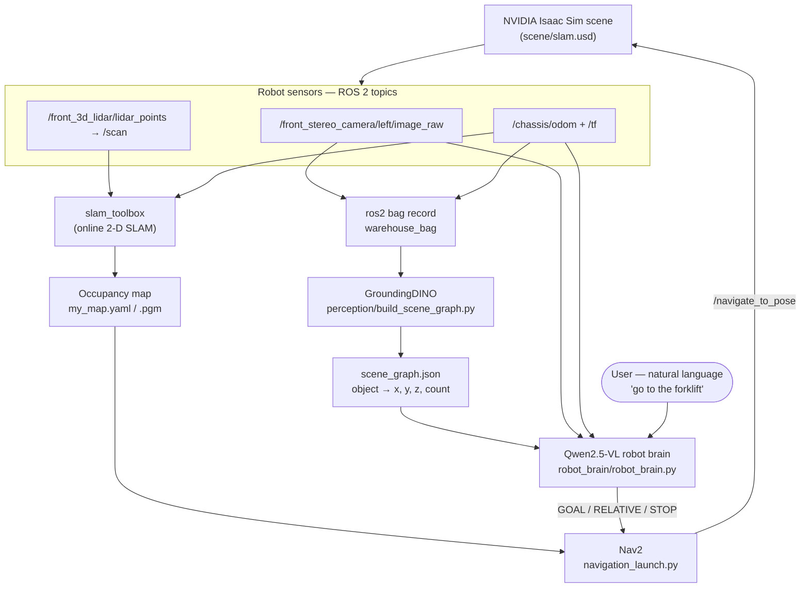

# Language-Guided Semantic Robot Navigation in NVIDIA Isaac Sim
### ROS 2 · SLAM · Nav2 · GroundingDINO · Qwen2.5-VL

> A **vision-language-model (VLM) robot** that maps a warehouse with **SLAM**, builds an **open-vocabulary semantic scene graph** with **GroundingDINO**, and then navigates to **natural-language goals** ("*go to the forklift*", "*go forward 1 meter*", "*what do you see?*") through **Nav2** — all reasoned by **Qwen2.5-VL** and simulated in **NVIDIA Isaac Sim** with **ROS 2 Humble**.


**Keywords:** vision-language model robot navigation · natural language navigation · open-vocabulary detection · semantic scene graph · Isaac Sim ROS 2 · slam_toolbox · Nav2 · GroundingDINO · Qwen2.5-VL · LLM robot control · mobile robot autonomy.

---

## Overview

This project turns a simulated mobile robot into one you can **command in plain English**. It combines four building blocks into a single pipeline:

1. **SLAM mapping** — `slam_toolbox` builds a 2‑D occupancy map of a warehouse while the robot is tele-operated, and a ROS 2 bag records the camera, LiDAR, odometry and TF.
2. **Open-vocabulary perception** — **GroundingDINO** runs over the recorded camera frames to detect arbitrary objects (*box, shelf, pallet, forklift, door, crate, container, ladder, cone…*) and fuses each detection with the robot's odometry into a **semantic scene graph** (`object → averaged x, y, z`).
3. **Autonomous navigation** — **Nav2** localizes on the saved map and drives the robot to any goal pose.
4. **The robot brain** — **Qwen2.5-VL** takes your natural-language instruction (plus the live camera image and current pose), grounds it against the scene graph, and emits a structured action — `GOAL:(x,y)`, `RELATIVE:(dx,dy)`, `STOP`, or a description — which is dispatched to Nav2.

The result is language-guided **semantic navigation**: ask for an object by name and the robot goes there; ask it to move relative to itself and it does; ask what it sees and it describes the camera view.

## System Architecture



## How it works, stage by stage

| Stage | Tool | Input | Output |
|---|---|---|---|
| 1. Map + record | `slam_toolbox`, `teleop_twist_keyboard`, `ros2 bag` | LiDAR, odom, camera | `my_map.yaml`, `warehouse_bag` |
| 2. Navigation | `nav2_bringup` | saved map | reachable goal poses |
| 3. Scene graph | GroundingDINO | `warehouse_bag` | `scene_graph.json` |
| 4. Robot brain | Qwen2.5-VL 3B | scene graph + camera + odom + your text | Nav2 goal / answer |

**The robot brain's action grammar** (`robot_brain/robot_brain.py`):
- `GOAL:(x,y)` — navigate to a **named object** from the scene graph (with a small stand-off offset so it stops in front of, not inside, the object).
- `RELATIVE:(dx,dy)` — robot-relative move ("forward 1 m", "left 2 m"); the system adds the offset to the current pose.
- `STOP` — cancel the active goal.
- Plain text — answer questions or describe the camera view (vision is triggered by words like *see / look / camera / view*).

## Repository structure

```
vlm-robot-navigation-isaac-sim-ros2/
├── README.md
├── LICENSE
├── scene/
│   └── slam.usd                     # the Isaac Sim warehouse scene
├── perception/
│   └── build_scene_graph.py         # GroundingDINO → scene_graph.json
├── robot_brain/
│   └── robot_brain.py               # Qwen2.5-VL natural-language navigation
├── setup/
│   ├── install_groundingdino.sh
│   └── install_qwen.sh
└── docs/
    └── commands.md                  # every ROS 2 command, in order
```

## Requirements

- **NVIDIA Isaac Sim** + an NVIDIA GPU (CUDA) — opens `scene/slam.usd`.
- **ROS 2 Humble** with `slam_toolbox`, `nav2_bringup`, `teleop_twist_keyboard`, `nav2_map_server`.
- Python: `torch`, `transformers`, `accelerate`, `qwen-vl-utils`, `rosbags`, `opencv-python`, `Pillow`, GroundingDINO.

## Quickstart

Full, ordered commands are in **[docs/commands.md](docs/commands.md)**. In short:

```bash
# 1) Map the environment + record a bag (Isaac Sim playing scene/slam.usd)
#    slam_toolbox + teleop, then:  ros2 run nav2_map_server map_saver_cli -f ~/my_map

# 2) Build the semantic scene graph from the bag
bash setup/install_groundingdino.sh
python3 perception/build_scene_graph.py

# 3) Bring up Nav2 on the saved map
ros2 launch nav2_bringup navigation_launch.py use_sim_time:=True map:=/root/my_map.yaml

# 4) Talk to the robot
bash setup/install_qwen.sh
source ~/qwen_env/bin/activate
python3 robot_brain/robot_brain.py
```

Example prompts once the brain is running:
> `go to the forklift` · `go forward 1 meter` · `move back 2 meters` · `what do you see?` · `stop`

## Acknowledgements

- [NVIDIA Isaac Sim](https://developer.nvidia.com/isaac/sim)
- [`slam_toolbox`](https://github.com/SteveMacenski/slam_toolbox) and [Nav2](https://navigation.ros.org/)
- [GroundingDINO](https://github.com/IDEA-Research/GroundingDINO) (IDEA-Research)
- [Qwen2.5-VL](https://github.com/QwenLM/Qwen2.5-VL) (Alibaba Qwen team)

## License

Released under the [MIT License](LICENSE).
