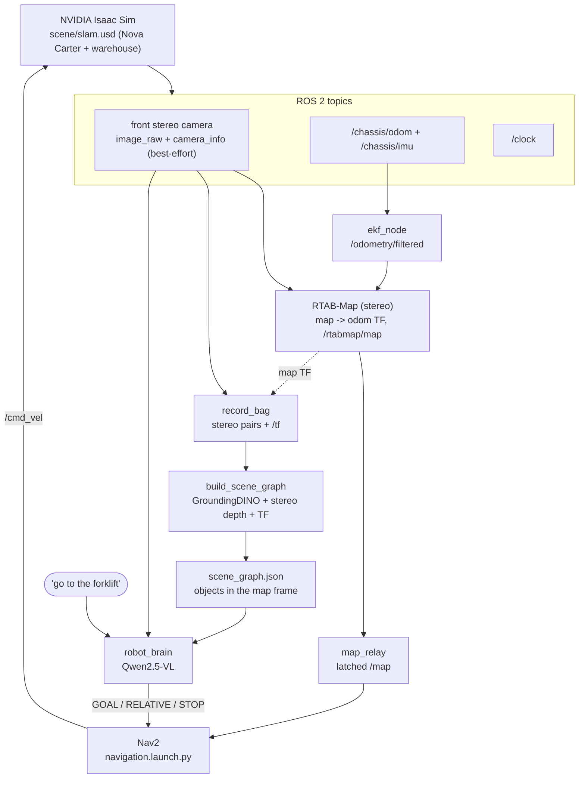

# Language-Guided Semantic Robot Navigation in NVIDIA Isaac Sim
### ROS 2 · SLAM (slam_toolbox lidar or RTAB-Map stereo) · Nav2 · GroundingDINO · Qwen2.5-VL

> A **vision-language-model (VLM) robot** that maps a warehouse with **SLAM**, builds an
> **open-vocabulary semantic scene graph** with **GroundingDINO** (object positions in the SLAM map frame),
> and then navigates to **natural-language goals** ("*go to the forklift*", "*go forward 1 meter*",
> "*what do you see?*") through **Nav2**, all reasoned by **Qwen2.5-VL** in **NVIDIA Isaac Sim** with
> **ROS 2 Humble**.


## Overview

1. **SLAM** - `slam_toolbox` on the 2-D lidar (recommended, `slam_lidar.launch.py`) or RTAB-Map on the stereo camera
   fused with odometry/IMU by an EKF (`slam.launch.py`) builds the occupancy map and the `map -> odom -> base_link`
   TF chain. One launch file starts either pipeline.
2. **Open-vocabulary perception** - GroundingDINO detects objects (*box, shelf, pallet, forklift, door, ...*) in
   recorded frames. Stereo matching gives metric depth, so each detection becomes a **3-D point in the map frame**;
   repeated sightings are clustered into distinct instances (`box_1`, `box_2`, `forklift_1`, ...).
3. **Autonomous navigation** - Nav2 plans on the live SLAM map and drives to any goal pose.
4. **The robot brain** - Qwen2.5-VL turns your sentence (plus the live camera image and the robot's pose) into
   `GOAL:<object name>`, `MOVE:<direction> <m>`, `STOP`, or a plain answer. **The model never types coordinates**: it
   names an object and the code looks up where it is.

## System architecture



## Repository structure

```
vlm-robot-navigation-isaac-sim-ros2/          # a ROS 2 (ament_python) package named vlm_nav
├── package.xml  setup.py  setup.cfg  resource/
├── vlm_nav/
│   ├── build_scene_graph.py   # bag -> scene_graph.json (stereo depth + TF + clustering)
│   ├── detector.py            # GroundingDINO wrapper (lazy torch import)
│   ├── robot_brain.py         # Qwen2.5-VL chat loop -> Nav2 goals
│   ├── command_parser.py      # prompt + GOAL/RELATIVE/STOP grammar
│   ├── scene_graph.py         # clustering, name resolution, JSON I/O
│   ├── stereo.py  geometry.py  image_utils.py  pairing.py
│   ├── record_bag.py          # throttled stereo + TF bag recorder
│   └── map_relay.py           # /rtabmap/map -> latched /map
├── launch/    slam_lidar.launch.py  slam.launch.py  navigation.launch.py
├── config/    slam_toolbox_lidar.yaml  nav2_params_lidar.yaml  ekf.yaml  nav2_params_camera.yaml  map_view.rviz
├── scene/     slam.usd                            # Isaac Sim scene, now with a /clock publisher
├── scripts/   pipeline.sh  add_clock_graph.py  nav_smoke_test.py
├── setup/     install_groundingdino.sh  install_qwen.sh
├── requirements/  perception.txt  brain.txt  dev.txt  constraints.txt
├── tests/
└── docs/commands.md
```

## Quickstart

Full, ordered commands (including one-time machine setup) are in **[docs/commands.md](docs/commands.md)**.

```bash
# build
mkdir -p ~/ws/src && cd ~/ws/src && git clone https://github.com/mohanapavan/vlm-robot-navigation-isaac-sim-ros2.git vlm_nav && cd ~/ws
colcon build --symlink-install && source install/setup.bash

# 1) Isaac Sim: open scene/slam.usd, press Play, check `ros2 topic hz /clock`

# 2) SLAM + map (one terminal), then drive around and record stereo data (two more terminals)
ros2 launch vlm_nav slam_lidar.launch.py          # or: slam.launch.py (camera only)
ros2 run teleop_twist_keyboard teleop_twist_keyboard
ros2 run vlm_nav record_bag --output ~/warehouse_bag --ros-args -p use_sim_time:=true

# 3) scene graph (GroundingDINO env)
bash setup/install_groundingdino.sh
source ~/perception_env/bin/activate
python -m vlm_nav.build_scene_graph --bag ~/warehouse_bag

# 4) navigation + brain (Qwen env)
ros2 launch vlm_nav navigation.launch.py sensor:=lidar     # (no argument for the camera pipeline)
bash setup/install_qwen.sh && source ~/qwen_env/bin/activate
python -m vlm_nav.robot_brain --ros-args -p use_sim_time:=true
```

Once the map and scene graph exist, `scripts/pipeline.sh start` brings up SLAM (resuming the saved map) and Nav2 in the
right order; then run the brain. See the *Quick start* at the top of [docs/commands.md](docs/commands.md).

Example prompts: `go to the forklift` · `go to box_2` · `go forward 1 meter` · `move left 2 meters` ·
`which forklift is closest?` · `what do you see?` · `stop`

## Results

See **[docs/RESULTS.md](docs/RESULTS.md)** (also as a Word report, `docs/Nova_VLM_Navigation_Report.docx`): a video of Nova driving to
the forklift, the saved map and scene graph, how close the robot gets, and everything we changed.

[](docs/media/nova_reaches_forklift.mp4)

## What was fixed (see [CHANGELOG.md](CHANGELOG.md))

The original pipeline stored *where the robot stood* instead of where the object was, in the odometry frame but
used as the map frame, and let the model copy coordinates out of the prompt. The scene graph is now built from
stereo depth and TF in the map frame, goals are looked up by name, relative moves respect heading, goals face the
object, results and timeouts are reported, and the whole pipeline starts from launch files.

## Testing

```bash
source /opt/ros/humble/setup.bash
pip install -r requirements/dev.txt
python3 -m pytest tests -q            # ~100 tests; ROS tests use their own DDS domain (87)
python3 scripts/nav_smoke_test.py     # end-to-end check on the *running* sim + SLAM + Nav2
```

## Known limitations

- **Map drift:** the bag stores the `map -> odom` TF as it was at record time. If RTAB-Map later closes a loop and
  shifts the map, objects located earlier are not moved with it.
- **Positions are object surfaces**, not centres (stereo sees the face toward the camera); `--standoff` accounts
  for it.
- **Camera-only mapping is coarse.** The stereo occupancy grid is noisy (thick walls, narrow gaps): goals in tight
  spaces or unexplored areas are refused by the planner and end `ABORTED`. Prefer the lidar pipeline where you can.
- **Keep the same SLAM session.** Object positions live in the `map` frame of the SLAM run active while recording;
  restarting SLAM (or the simulator) shifts `map` and therefore every object.
- The lidar pipeline was checked for map, TF chain and Nav2 planning on the running simulator; driving with it and the
  brain end to end was not repeated (that was done with the camera pipeline).
- **Simulator load:** with all Nova Carter cameras rendering, Isaac Sim can run well below real time; Nav2 on a
  heavily loaded machine can stall after a few goals (behaviour-tree tick warnings, repeated controller aborts).
- GroundingDINO and Qwen2.5-VL need a GPU environment and model downloads; their code paths are exercised in the tests
  only through stand-ins.

## Acknowledgements

- [NVIDIA Isaac Sim](https://developer.nvidia.com/isaac/sim)
- [RTAB-Map](https://github.com/introlab/rtabmap_ros), [robot_localization](https://github.com/cra-ros-pkg/robot_localization) and [Nav2](https://navigation.ros.org/)
- [GroundingDINO](https://github.com/IDEA-Research/GroundingDINO) (IDEA-Research)
- [Qwen2.5-VL](https://github.com/QwenLM/Qwen2.5-VL) (Alibaba Qwen team)

## License

Released under the [MIT License](LICENSE).
