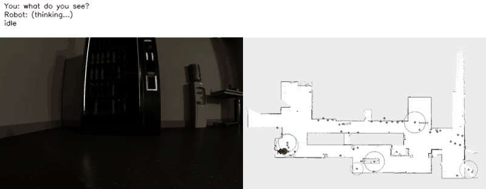
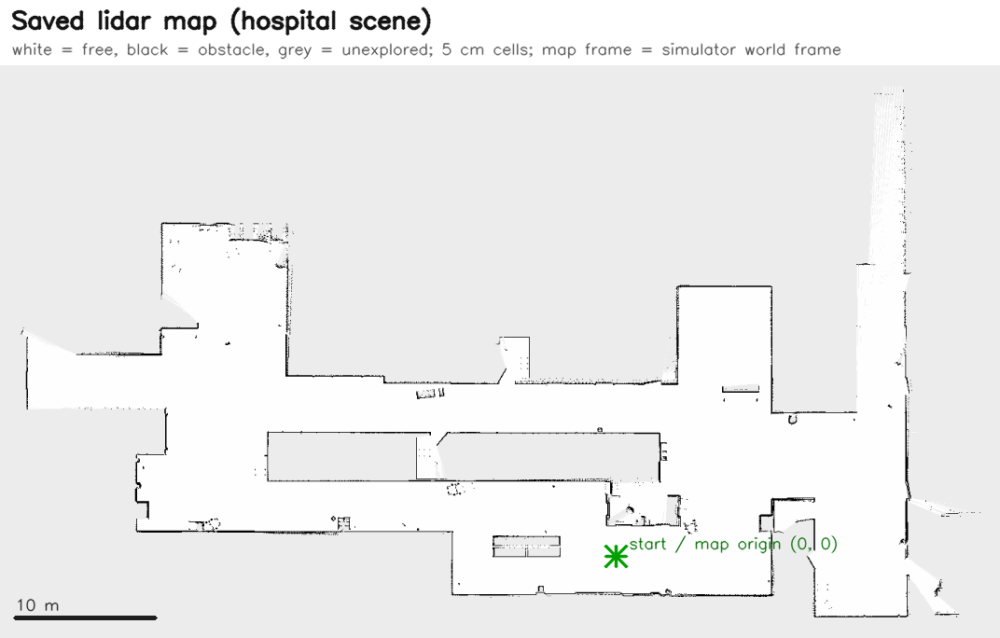
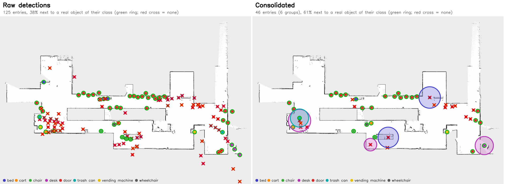
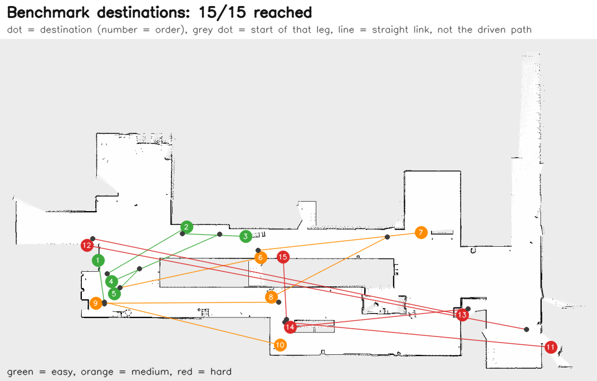

# Evaluation on the hospital scene

Everything here was measured on the running stack: Isaac Sim 6.0 (`scene/slam.usd`), the saved lidar map and saved
detections from the project backup (nothing re-recorded), Nav2, and Qwen2.5-VL-3B on one RTX 5080. The simulator ran at
roughly 0.25 to 0.7 times real time, so wall-clock durations are longer than the simulated ones.

The same results as a Word report: [Hospital_VLM_Navigation_Report.docx](Hospital_VLM_Navigation_Report.docx). The demo above was
recorded with `scripts/record_demo.py` (typed commands through Qwen, the robot camera, the trail on the saved map).

The map, the raw detections and the consolidated graph used below are in `saved_state/hospital/`.

## 1. The saved map matches the simulator

`evaluation/hospital_ground_truth.json` holds the world-space boxes of the scene's real objects (`SM_HospitalBed_*`,
`BP_DrinksMachine_*`, ...), extracted from the loaded stage. The robot spawns at the world origin with yaw 0. Rasterising the
scene's wall geometry and sliding the saved map over it gives the best fit at a shift of 0.0 m and 0 degrees (81 % of occupied
cells lie within 0.3 m of a wall or door; the rest are furniture). So **map frame = world frame**, which is what makes an
identity `map -> odom` correct, and `scripts/check_map_alignment.py` confirms it live: 100 % of lidar endpoints land within
0.15 m of an occupied cell of the saved map.

## 2. Why 149 objects: the saved detections against the real scene

Real objects in the scene (of the classes detected): 14 beds and gurneys, 28 carts, 21 chairs, 12 desks, 48 doors, 11 trash
cans, 2 vending machines, 4 wheelchairs. An entry is a hit when a real object of its class lies within 1.5 m of it (measured to the
object's footprint, since detections are surface points).

| class | raw entries | consolidated | real | precision raw -> cons. | recall raw -> cons. |
|---|---|---|---|---|---|
| bed | 14 | 3 | 14 | 0.29 -> 0.33 | 0.14 -> 0.07 |
| cart | 12 | 3 | 28 | 0.25 -> 0.33 | 0.07 -> 0.04 |
| chair | 10 | 2 | 21 | 0.40 -> 1.00 | 0.24 -> 0.14 |
| desk | 23 | 3 | 12 | 0.13 -> 0.33 | 0.42 -> 0.50 |
| door | 38 | 27 | 48 | 0.74 -> 0.70 | 0.31 -> 0.27 |
| trash can | 9 | 1 | 11 | 0.22 -> 1.00 | 0.18 -> 0.09 |
| vending machine | 18 | 6 | 2 | 0.11 -> 0.33 | 1.00 -> 1.00 |
| wheelchair | 1 | 1 | 4 | 1.00 -> 1.00 | 0.25 -> 0.25 |
| **all** (24 wall entries excluded from "raw") | **125** | **46** | 156 | **0.38 -> 0.61** | **0.22 -> 0.18** |

Reading it honestly:

* Consolidation removes about two thirds of the entries and raises precision from 0.38 to 0.61, at a small cost in recall
  (34 -> 28 of 156 real objects covered). Recall is limited by the saved detections themselves, not by consolidation: the raw graph
  covers only 34 of the 156.
* 16 of the 18 vending-machine entries were on other things (doors, cabinets, empty floor) and had scores like the correct ones, so
  the detector's confidence cannot separate them. What did help: evidence, agreement between nearby detections, and the map
  (an entry 1 m or more from every mapped obstacle was 85 % wrong). Being in unexplored space was *not* informative on its
  own (38 % real, like the average), so that penalty is a judgement call: without it the result is 56 entries at precision 0.57
  instead of 46 at 0.61. `python3 scripts/analyze_scene_graph.py saved_state/hospital/scene_graph.json` prints these measurements.
* The remaining errors need better *observations* (a second pass with the range-aware, deduplicated pipeline, changes 33 in the
  changelog), which was not done here because it needs a new recording and GroundingDINO.

Green ring = a real object of that class within 1.5 m, red cross = none. Groups are drawn at their size. A few raw
detections fall outside the saved map altogether (bottom right of the left panel).

Reproduce: `python3 scripts/eval_scene_graph.py ~/scene_graph/scene_graph.json ~/scene_graph/scene_graph.consolidated.json`
and `python3 scripts/plot_scene_graph.py compare RAW.json CONSOLIDATED.json OUT.png`.

## 3. Five typed commands (Qwen -> Nav2 -> robot, live)

`scripts/live_command_test.py` (first run, before the section 5 fixes; re-run on the final code below), 5/5:

| command | model reply | outcome |
|---|---|---|
| "go forward 2 meters" | `MOVE:forward 2` | SUCCEEDED, moved 1.76 m forward, 0.03 m sideways |
| "go to the wheelchair" | `GOAL:wheelchair_1` | SUCCEEDED, 1.04 m from it (stand-off 0.8), facing error 10 deg |
| "what do you see?" | "I see a wheelchair and a cart in the room. ..." | answered in words; robot moved 0.03 m; no goal sent |
| "go to the spaceship" | "I don't know an object called spaceship." | no goal sent, robot did not move |
| "go to desk_1" (a group of 3, 3.7 m wide) | `GOAL:desk_1` | SUCCEEDED, 2.87 m from the group's centre (expected about 2.6 m: its edge plus the stand-off) |

Re-run on the final code (after the section 5 changes), again **5/5**:

| command | model reply | outcome |
|---|---|---|
| "go forward 2 meters" | `MOVE:forward 2` | SUCCEEDED, moved 1.84 m forward, 0.12 m sideways |
| "go to the wheelchair" | `GOAL:wheelchair_1` | SUCCEEDED, 0.83 m from it, facing error 3 deg |
| "what do you see?" | "A wheelchair is located at coordinates approximately (-11.09, 3.44) ..." | answered in words, no motion, no goal (but see below) |
| "go to the spaceship" | "I don't know an object called spaceship." | no goal sent, robot did not move |
| "go to desk_1" (group) | `GOAL:desk_1` | SUCCEEDED, 2.83 m from the group's centre |

The vision answer in this run passed the check (words, no motion) but was wrong: the model read the *robot's own* pose
from the prompt back as the wheelchair's position. The question prompt now says the pose is the robot's, and to describe
the picture; with the real camera image the model then answered "The robot is facing a wall with a table against it. There is a
door to the left of the table. ..." and "where are you?" still gives the pose (changelog 37).

## 4. Fifteen destinations: 5 easy, 5 medium, 5 hard

`scripts/destination_benchmark.py` on the restarted simulator. Difficulty is the length of the path Nav2's planner finds from
where the robot stands when the destination is chosen: **easy 3-12 m, medium 12-30 m, hard over 30 m** (hard prefers groups
and spots tight against a wall; each tier prefers classes it has not used yet). Every destination is typed to Qwen as a
sentence. A destination passes when the reply is understood, Nav2 reports SUCCEEDED, the robot ends within 0.6 m of the goal
point it was sent to, faces the object (within 40 deg), and it went to the object that was asked for. "real object" checks
the entry the robot drove to against the simulator's ground truth (is a real object of that class within 1.5 m of it?).

| # | tier | you said | model replied | planned m | driven m | sim s | goal err m | facing err deg | result | real object |
|---|---|---|---|---|---|---|---|---|---|---|
| 1 | easy | "go to door_21" | `GOAL:door_21` | 3.8 | 3.7 | 14 | 0.21 | 8 | SUCCEEDED | yes |
| 2 | easy | "take me to door_8" | `GOAL:door_8` | 10.5 | 10.3 | 32 | 0.2 | 7 | SUCCEEDED | yes |
| 3 | easy | "navigate to the bed" | `GOAL:bed_1` | 4.8 | 4.6 | 14 | 0.21 | 13 | SUCCEEDED | yes |
| 4 | easy | "head to trash_can_1" | `GOAL:trash_can_1` | 11.1 | 11.0 | 37 | 0.2 | 13 | SUCCEEDED | yes |
| 5 | easy | "go to vending_machine_6" | `GOAL:vending_machine_6` | 3.5 | 3.2 | 9 | 0.24 | 1 | SUCCEEDED | no |
| 6 | medium | "go to door_2" | `GOAL:door_2` | 18.6 | 18.5 | 58 | 0.21 | 3 | SUCCEEDED | yes |
| 7 | medium | "take me to bed_2" | `GOAL:bed_2` | 16.0 | 15.8 | 46 | 0.21 | 12 | SUCCEEDED | no |
| 8 | medium | "navigate to the wheelchair" | `GOAL:wheelchair_1` | 29.6 | 29.2 | 76 | 0.25 | 5 | SUCCEEDED | yes |
| 9 | medium | "head to vending_machine_3" | `GOAL:vending_machine_3` | 21.3 | 21.0 | 55 | 0.21 | 8 | SUCCEEDED | yes |
| 10 | medium | "go to desk_1" | `GOAL:desk_1` | 22.6 | 22.5 | 68 | 0.21 | 10 | SUCCEEDED | no |
| 11 | hard | "go to desk_2" | `GOAL:desk_2` | 34.1 | 33.7 | 93 | 0.25 | 12 | SUCCEEDED | yes |
| 12 | hard | "take me to door_27" | `GOAL:door_27` | 55.9 | 55.4 | 148 | 0.24 | 7 | SUCCEEDED | yes |
| 13 | hard | "navigate to vending_machine_2" | `GOAL:vending_machine_2` | 54.2 | 53.8 | 143 | 0.24 | 1 | SUCCEEDED | yes |
| 14 | hard | "head to chair_2" | `GOAL:chair_2` | 32.4 | 31.9 | 90 | 0.2 | 7 | SUCCEEDED | yes |
| 15 | hard | "go to door_4" | `GOAL:door_4` | 39.0 | 38.6 | 104 | 0.2 | 13 | SUCCEEDED | yes |

| tier | passed | mean planned path | mean goal error | mean facing error | simulated time | entry is a real object |
|---|---|---|---|---|---|---|
| easy | 5/5 | 6.7 m | 0.21 m | 8 deg | 106 s | 4/5 |
| medium | 5/5 | 21.6 m | 0.22 m | 8 deg | 303 s | 3/5 |
| hard | 5/5 | 43.1 m | 0.23 m | 8 deg | 578 s | 5/5 |
| **all** | **15/15** | | | | 987 s (353 m driven) | **12/15** |

**Read the last column carefully.** "Passed" means the *system* did what it was told: understood the sentence and drove to
that entry of its scene graph. Three of the 15 entries are not real objects: `vending_machine_6` (the nearest real machine is
4.0 m from where the robot stopped), `bed_2` (11.1 m) and `desk_1` (9.3 m). Those are the look-alike detections described in
section 2; the robot went exactly where the graph said. Navigation is not the weak point, perception recall/precision is.

## 5. What the first attempt at section 4 found (and what was changed)

A first run, on the code as it stood after section 3, was stopped after 8 destinations because it exposed real problems.
Easy 5/5, then:

| # | what happened | cause | change |
|---|---|---|---|
| 6 | "go to door_13" -> "I don't know an object called door_13." (it exists) | the prompt lists only the nearest 6 objects per class, so an id the user typed could be hidden from the model | objects the user names are always listed (`mentioned_objects`) |
| (2) | "take me to the cart": the model answered `GOAL:cart_1`, a cart 26 m away, instead of the nearest (4.4 m) | a 3B model picks an arbitrary instance | `reconcile_goal`: a bare class means nearest; an explicit id beats a different one the model wrote |
| 7, 8 | ABORTED after 1.4 m, "collision ahead" then "failed to make progress" | the plan out of the chair_1 stand-off hugged the chair (0.51 m from the mapped cells); the chair's low base is below the 2-D lidar plane, so the robot was physically held; `SimpleProgressChecker` also counts only translation | Nav2 inflation 0.5 -> 0.9 m (plan 0.3 m longer, at least 0.77 m from every mapped obstacle), `PoseProgressChecker`, and stop points with at least 0.7 m of clearance are preferred |

After those changes the whole benchmark was run again from a fresh simulator start: section 4.

## 6. Raw data and how to redo it

Everything above can be checked from the repository: the scene dump and the ground truth built from it, the raw results of the
15 destinations (and of the first, partly failed attempt), and the outputs of the 5-command runs are in
[`evaluation/`](../evaluation/README.md) with the commands that rebuild the analysis; `tests/test_ground_truth.py` checks that
the committed ground truth is exactly what the committed dump gives and that the saved graph gives the numbers quoted here.

## Not verified

* The per-frame box filtering, view counting and range weighting in `build_scene_graph` (changelog 33) are covered by unit
  tests and the synthetic-bag test only: no GroundingDINO run and no new recording were done, as agreed.
* Recall of the scene graph (about 0.18 of the real objects) can only improve with new observations.
* The camera-only pipeline (`slam.launch.py`, RTAB-Map) was not run; it received only the progress-checker change.
* Sub-lidar-plane obstacles (chair bases, cart shelves, forks) are still invisible to the map. Wider inflation makes plans
  avoid the mapped parts of such objects by more; it does not detect what the lidar cannot see.
