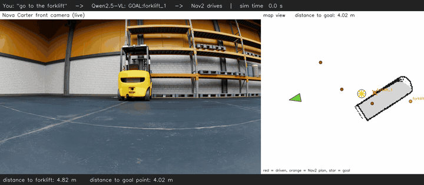
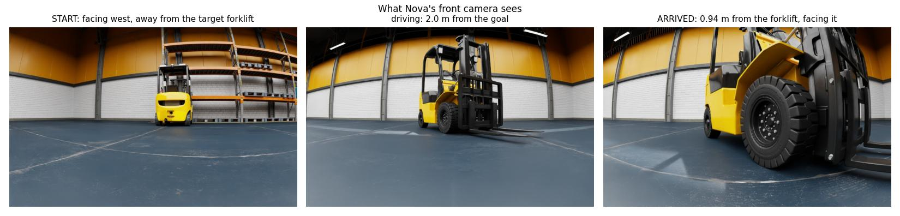
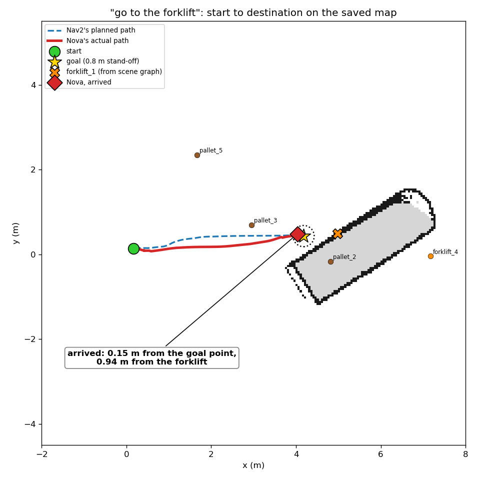
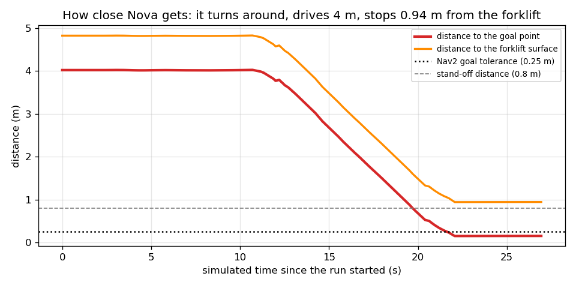
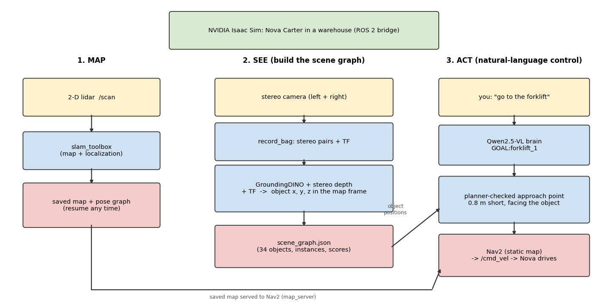
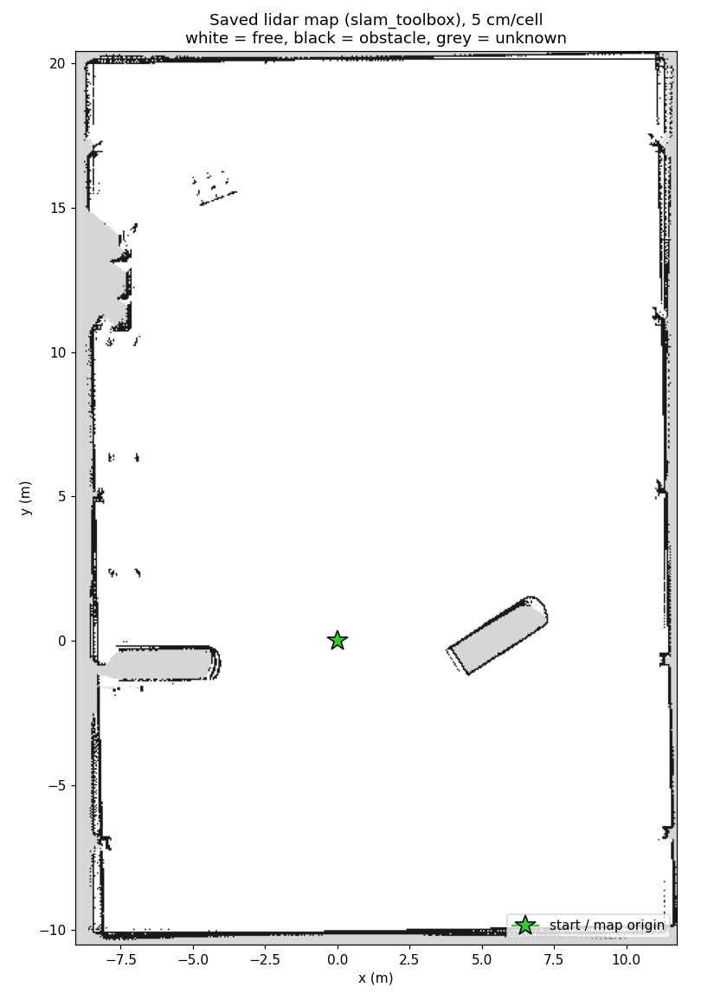
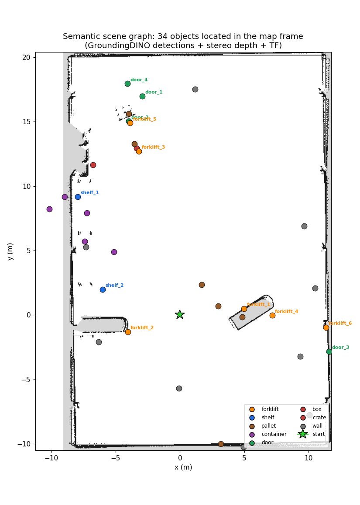
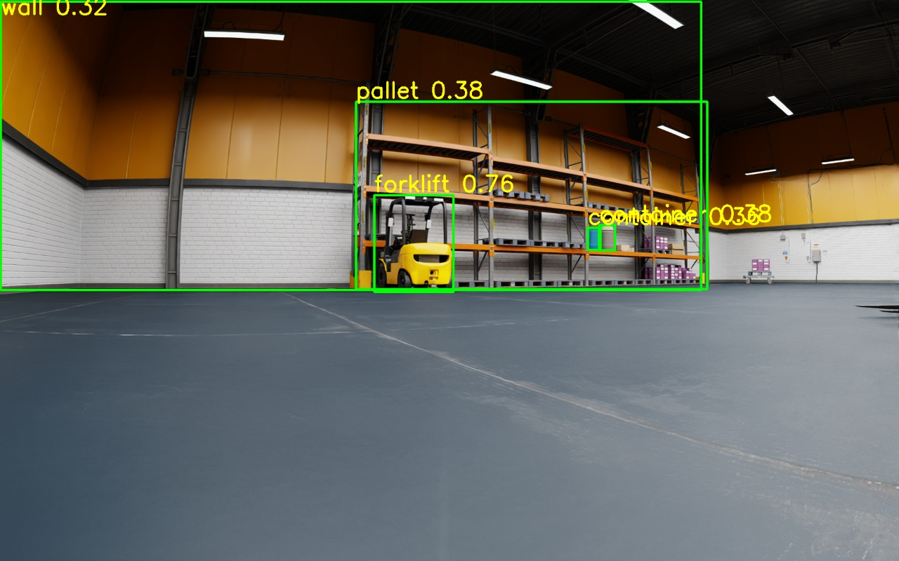
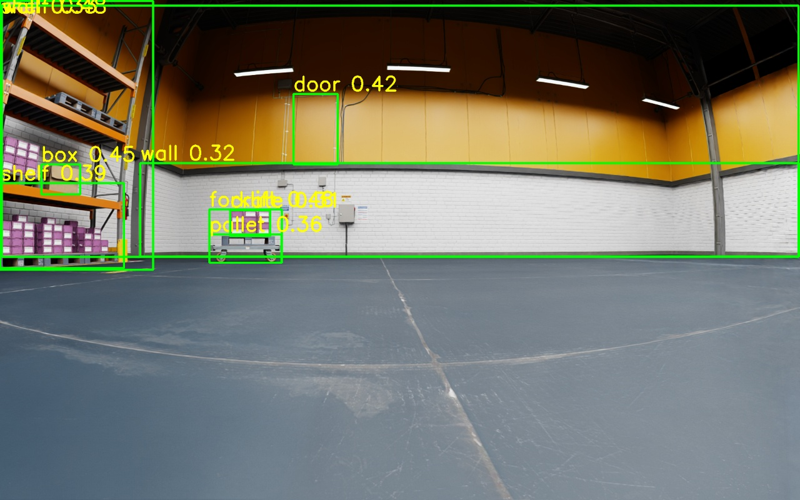

# Language-guided navigation of a Nova Carter robot: results

A simulated Nova Carter (NVIDIA Isaac Sim, ROS 2 Humble) maps a warehouse, builds a semantic scene graph with GroundingDINO, and drives to natural-language goals through Nav2, with Qwen2.5-VL as the brain. This report shows what the system does, how close the robot gets to its goals, what we changed, and what we found along the way. Every number below was measured on the running simulator (RTX 5080, Isaac Sim 6.0, ROS 2 Humble).

## 1. The result in one run

Command: "go to the forklift". Qwen2.5-VL answers GOAL:forklift_1; the code looks up where that object is and asks Nav2's planner for a reachable approach point 0.8 m short of it, facing it. Nova starts facing away, turns around, and drives to the forklift.

|  | Measured |
|---|---|
| Start | map (0.17, 0.14), facing away from the forklift (-163 deg) |
| Arrival | map (4.04, 0.48), heading within 1 deg of the forklift |
| Distance to the goal point | 0.15 m (Nav2 tolerance 0.25 m) |
| Distance to the forklift (its detected surface point) | 0.94 m (stand-off 0.8 m + tolerance) |
| Distance driven / drive time | 4.06 m / 18.4 simulated seconds, including turning around |
| Nav2 result | SUCCEEDED, no TF errors, no empty plans |

[](media/nova_reaches_forklift.mp4)
*Video (27 s): Nova's own camera on the left, the map with its path on the right. Click for the full-quality MP4.*


*What Nova's front camera sees at the start, on the way, and on arrival.*


*Start to destination on the saved map: Nav2's plan (blue dashed), Nova's actual path (red), the goal point (star) and the forklift position from the scene graph (X).*


*Distance over time: Nova turns in place for about 8 s, drives 4 m and settles inside the goal tolerance.*

## 2. How it works


*Three stages: map the warehouse, build the scene graph from recorded camera data, then act on natural-language commands.*

- **Map:** slam_toolbox builds a 2-D map from the lidar; the map and pose graph are saved and can be resumed after a restart (the same map frame comes back, so object coordinates stay valid).
- **See:** while driving, a small recorder keeps one complete stereo pair per second plus all TF. GroundingDINO finds objects in the frames, stereo matching gives metric depth, and TF places each detection in the map frame. Repeated sightings are clustered into instances (forklift_1, forklift_2, ...).
- **Act:** Qwen2.5-VL turns a sentence into GOAL:<name>, MOVE:<direction> <m> or STOP. The model never writes coordinates; the code looks the object up, asks Nav2 whether an approach point is reachable, and sends the goal.

## 3. The saved map and the scene graph


*The saved lidar map of the warehouse (5 cm cells): white = free, black = obstacle, grey = unknown. The green star is the start and the map origin.*


*The scene graph on the same map: 34 objects located in the map frame, coloured by class.*


*GroundingDINO on a recorded frame: the forklift (0.76), shelf pallets and containers.*


*Another frame: shelf, box, door and a hand cart. Some detections are wrong or duplicated, which is why sightings are clustered and single sightings are dropped.*

| Check | Result |
|---|---|
| Objects found from one recorded drive (57 stereo pairs) | 34 instances: 6 forklifts, 6 pallets, 5 containers, 9 walls, 4 doors, 2 shelves, 1 box, 1 crate |
| Speed | about 0.3 s per frame on the GPU (no compiler toolkit needed) |
| Agreement with the independent lidar map | median distance to the nearest mapped obstacle 0.77 m, versus 2.25 m for a random free cell; 42% within 0.5 m (random: 12%) |
| Forklifts specifically | median 0.30 m, 83% within 0.5 m |

## 4. How close the robot gets

| Test (live simulator, real Qwen + Nav2) | Asked | Result |
|---|---|---|
| "go to the forklift" (run above, final setup) | stand-off 0.8 m | 0.15 m from the goal point, 0.94 m from the forklift, 1 deg heading error |
| "go to the forklift" (an earlier run, before the final Nav2 fix) | stand-off 0.8 m | 0.23 m from the goal point, 1.03 m from the forklift, 3 deg |
| "go back 1 meter" | 1.0 m behind | ended 0.22 m from the requested point (Nav2 tolerance 0.25 m) |
| "go left 1 meter" | 1.0 m to the left | ended 0.23 m from the requested point |
| "stop" during a long drive | stop | robot moved 0.0 m after STOP, goal reported CANCELED |
| "which forklift is closest?" | question | answered in words (forklift_1), robot did not move |
| "what do you see?" | question + camera | described the live camera image |

The robot stops within Nav2's 0.25 m goal tolerance, which is why it typically ends 0.15 to 0.23 m from the exact goal point. The "distance to the forklift" is measured to the surface point the camera saw, and the stand-off is added on top of it.

## 5. What we changed

The starting point was a working idea with bugs that broke its core: the "map of objects" stored where the robot stood, not where the object was. These are the fixes to the 18 review items, and what we added.

| Problem in the original | Now |
|---|---|
| Stored the robot position, not the object position; boxes were never used | Stereo depth + TF put each detection in the map frame |
| Odom frame used as the map frame | Object and robot poses come from the map frame via TF |
| Relative moves ignored heading | Moves are rotated by the robot's current yaw |
| STOP matched anywhere and beat GOAL | GOAL/MOVE are parsed first; STOP counts as the first word of the reply |
| All same-class objects averaged into one point | Clustered into instances (forklift_1, forklift_2, ...) with per-class radii |
| The model copied coordinates from the prompt | The model names an object; the code looks up its position |
| Goal orientation always the same | The goal faces the object |
| Wrong QoS, image decoding, normalisation, timestamps | Sensor-data QoS, encoding-aware decoding, GroundingDINO's own transform, stamp-based pairing |
| Nothing reported success; blocking waits; hard-coded paths; no package | Results reported, timeouts, arguments instead of paths, a ROS 2 package with launch files, pinned requirements |

## Features added

- Lidar SLAM (slam_toolbox) and camera SLAM (stereo RTAB-Map) pipelines, each started by one launch file.
- Resume from a saved map: the map, the pose graph and the object coordinates stay consistent across restarts.
- A recorder that keeps complete stereo pairs plus TF, so a bag is small enough to keep.
- Planner-checked goals: the brain asks Nav2 whether an approach point is reachable, tries the next-nearest instance and a wider stand-off, or refuses without moving.
- A prompt tuned for a 3B model and evaluated on the real model (34 of 34 test commands), with direction-word moves (MOVE:left 1.5).
- Questions never move the robot: they get an answer-only prompt, and any command in the reply is ignored.
- One-command start and stop of SLAM + Nav2 (scripts/pipeline.sh), a clock-graph patch for the simulator scene, an end-to-end smoke test, and 137 automated tests.

## 6. Problems found by running the real system

Several problems only appeared with the real simulator and models. All are fixed and covered by tests or configuration checks.

- **The scene published no /clock**, so every simulation-time node waited forever. The scene now contains a clock graph.
- **The camera-only occupancy grid was unusable** with default settings (about 90% unknown, robot cell occupied). The launch file now passes tuned grid parameters.
- **Nav2 misbehaved with a laser-scan obstacle layer.** The planner's costmap stopped updating its robot pose right after start-up, so plans began where the robot *had been*. Goals only worked near the start-up position; from anywhere else the controller aborted ("Resulting plan has 0 poses"), and sometimes reported "Reached the goal!" instantly. Found by comparing what each costmap believed about the robot; fixed by using the static saved map in both costmaps.
- **slam_toolbox's own map changed size** every so often, resetting Nav2's costmaps mid-drive. In localization mode Nav2 now gets the fixed saved map from map_server.
- **The original prompt did not work on the real model:** "go forward 1 meter" produced a goal to a forklift, and "stop" was ignored. The rewritten prompt scores 34 of 34.
- **A stop point can land on a fork tip.** The forklift's forks sit below the lidar's scan plane, so the map does not show them; Nova stops close to the fork tips and cannot reverse into them. It is a limitation of a 2-D lidar, listed below.

## 7. Limits to keep in mind

- Detections are noisy: walls and pallets are the weakest classes and a few objects are placed outside the walls (depth error at range).
- Positions are the surface the camera saw, not the object centre.
- A 2-D lidar cannot see low obstacles such as fork tines; the stop point can be close to them.
- The simulator runs at about 0.44x real time with all cameras on, so timings here are in simulated seconds.
- Nav2 goal tolerance is 0.25 m, so the robot stops up to that far from the exact point. "Go back" turns around and drives, because the controller does not reverse.
- The video is made from the robot's camera and the map; a third-person view of the Isaac Sim window is not included.

## 8. Reproduce it

Full commands are in docs/commands.md. In short, after the one-time setup:

```bash
ros2 launch vlm_nav slam_lidar.launch.py                     # map (or mode:=localization to resume)
ros2 run vlm_nav record_bag --output ~/warehouse_bag ...         # drive with teleop while recording
python -m vlm_nav.build_scene_graph --bag ~/warehouse_bag        # GroundingDINO + stereo depth + TF
~/ws/src/vlm_nav/scripts/pipeline.sh start                       # SLAM (resume) + Nav2
python -m vlm_nav.robot_brain --ros-args -p use_sim_time:=true   # talk to the robot
```
